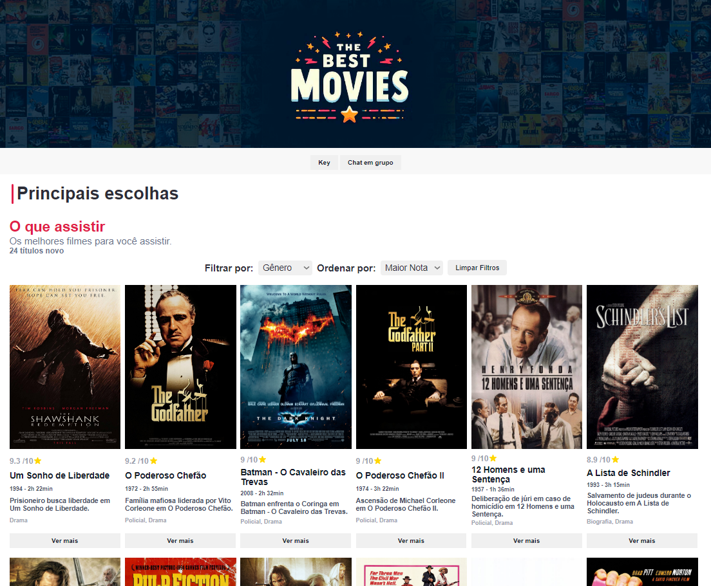
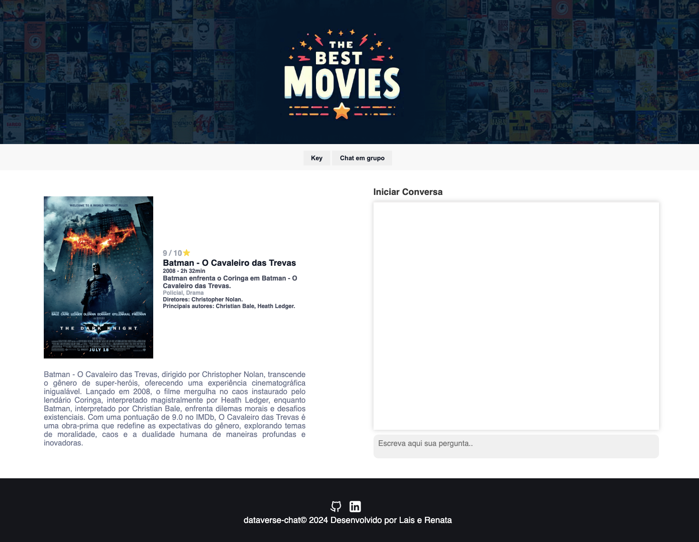
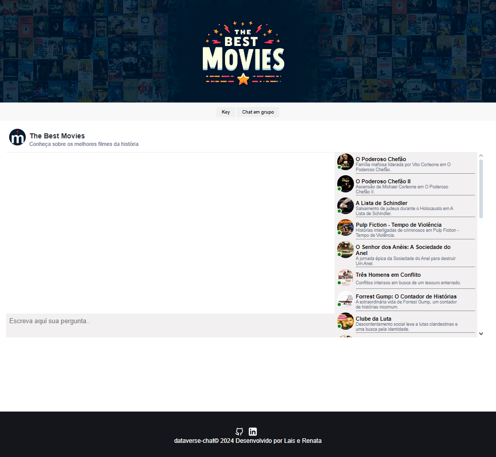
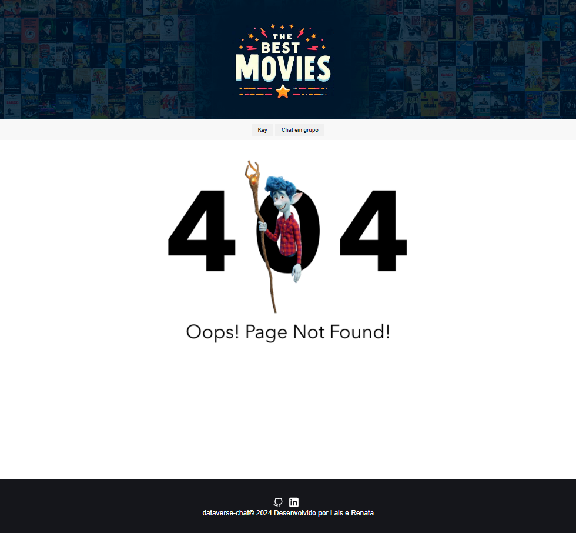

# The Best Movies

## Definição do Produto

**The Best Movies** pode ser definido como uma plataforma digital que permite aos usuários acessarem uma vasta quantidade de informações sobre filmes. Isso inclui detalhes como sinopses, classificações, gêneros, elenco, diretores e datas de lançamento. O The Best movies também oferece o serviço de recomendação com base nas preferências do usuário, ajudando-os a descobrir novos conteúdos com base em seus interesses.

### Recursos Principais

1. **Informações Detalhadas:** Oferece uma ampla gama de informações sobre filmes, com mais informações que são fornecidas de forma iterativa com a OpenIA
2. **Interatividade:** Permite que seja filtrado e ordenado os filmes e também ainteração com a IA que responde conforme o gênero do filme desde mais dramático ao mais engraçado.
4. **Galeria de Fotos:** Uma galeria com a capa dos filmes que foram sucesso de bilheteria.

## Histórias de Usuário

Como um amante do cinema, eu quero acessar um site que liste os 24 filmes mais famosos do mundo, para que eu possa explorar e descobrir novos filmes para assistir.

## Critérios de Aceitação:

1. **Na página inicial do site, os filmes são exibidos em cards responsivos, mostrando as seguintes informações:**
- Nome do filme
- Nota no IMDb
- Ano de lançamento
- Tempo de duração
- Breve resumo
- Gêneros

2. **Os filmes podem ser ordenados por nota no IMDb, permitindo ao usuário visualizar os filmes mais bem avaliados primeiro.**
- O usuário pode filtrar os resultados por gênero, para que possa encontrar filmes específicos de seu interesse.
- Ao clicar em um card, o usuário é redirecionado para a página do filme, onde encontra mais detalhes, incluindo:
- Diretor
- Estrelas do filme
- Sinopse

3. **Na página do filme, há um recurso de chat com a API do ChatGPT, permitindo ao usuário interagir com o filme por meio de conversas com o modelo de linguagem.**
- O chatbot é capaz de fornecer informações adicionais sobre o filme, responder perguntas comuns e até mesmo fornecer recomendações de outros filmes com base nas preferências do usuário.
- O site é responsivo, garantindo uma boa experiência de usuário em dispositivos móveis, tablets e desktops.
- As informações exibidas nos cards e nas páginas dos filmes são atualizadas e precisas, utilizando dados confiáveis ​​e atualizados sobre os filmes.

## Design da Interface de Usuário (Protótipo de Alta Fidelidade)

1. **Protótipo Home**

2. **Protótipo Chat**

3. **Protótipo Chat em  Grupo**

4. **Protótipo Erro**

5. **Protótipo de baixa fidelidade**

## Lista de Problemas Detectados por Meio de Testes de Usabilidade

Durante os testes de usabilidade, identificamos alguns problemas que precisam ser abordados para melhorar a experiência do usuário:

1. **Layout Não Responsivo:** Se o aplicativo não se adaptar corretamente a diferentes tamanhos de tela ou dispositivos, os usuários em dispositivos móveis podem ter dificuldade em acessar e usar o serviço.

2. **Falhas na Pesquisa:** Se a função de pesquisa não retornar resultados precisos ou se os filtros de pesquisa não funcionarem conforme o esperado, os usuários podem ter problemas para encontrar os filmes desejados.

3. **Feedback Insuficiente:** Se o aplicativo não fornecer feedback suficiente ao usuário, como confirmações de ação ou mensagens de erro claras, os usuários podem ficar confusos sobre o que está acontecendo.

## Referências

Durante a construção do projeto, usamos como inspiração e referência o **IMDb**, também conhecido como Internet Movie Database. É uma base de dados online de informação sobre cinema, TV, música e games, hoje pertencente à Amazon.
[Fonte: IMDb](https://www.imdb.com/)

## Tecnologias utilizadas

1. Html5
2. Css
3. JavaScript
4. Git
5. GitHub
6. GitHub Pages
7. Eslint
8. Jest
9. NodeJS
10. Figma
11. OpenIA

##  Deploy

Neste projeto, usei o Netlify para o deploy do site.  

(https://docs.netlify.com)

consultar a [documentação oficial](https://docs.netlify.com).